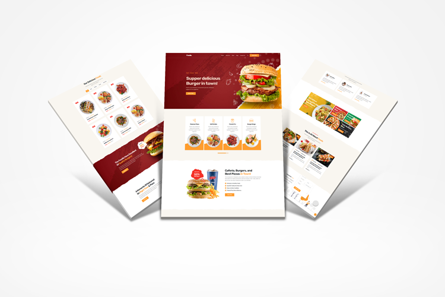

  <h2 align="center">Foodie - Restaurant Website</h2>

Foodie is a fully responsive restaurant website,  Responsive for all devices, build using HTML, CSS, and JavaScript.

<a href="https://russellbdevs.github.io/foodie/"><strong>➥ Live Demo</strong></a>

 

### Demo Screeshots

### Contact

  
